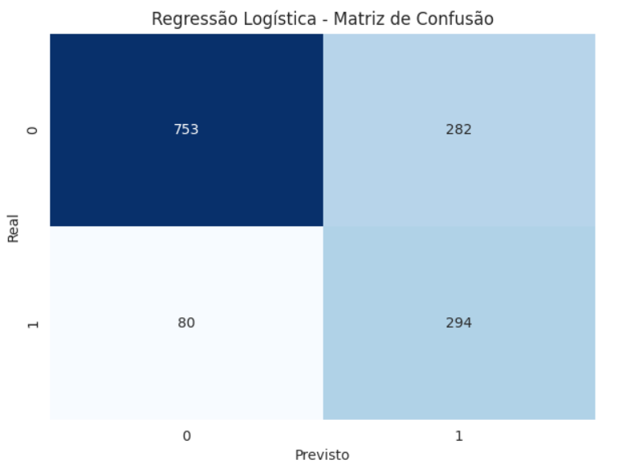
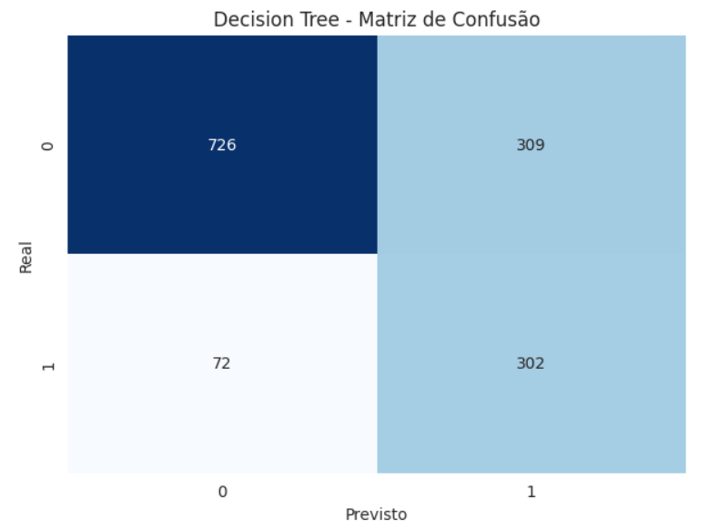
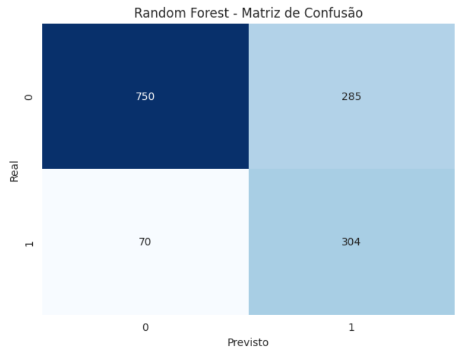
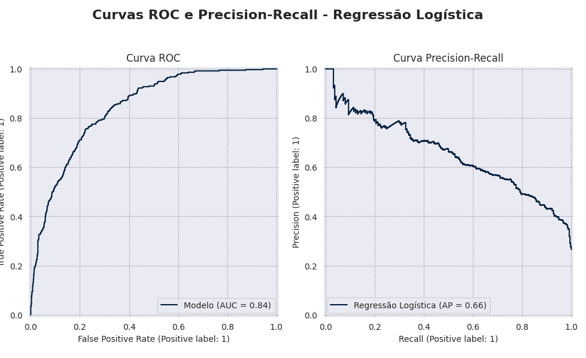
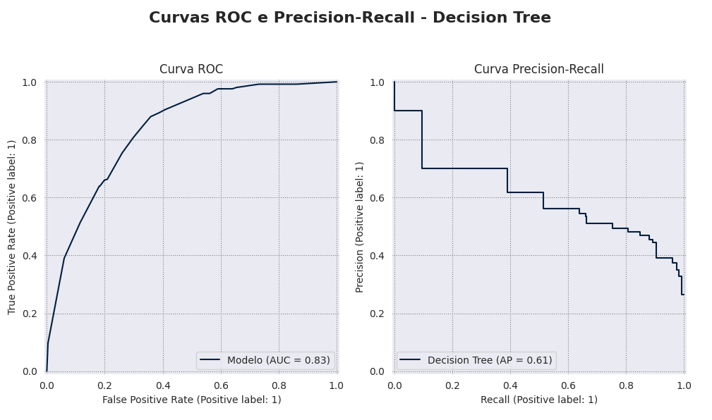
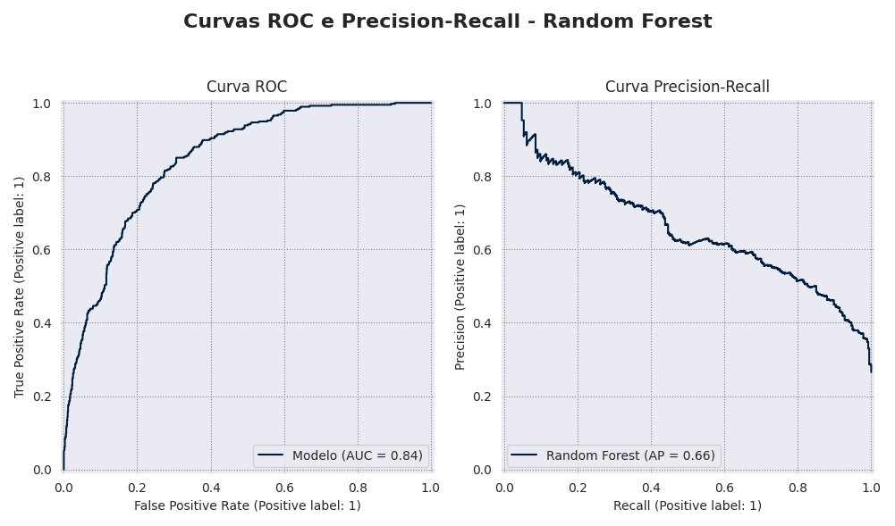
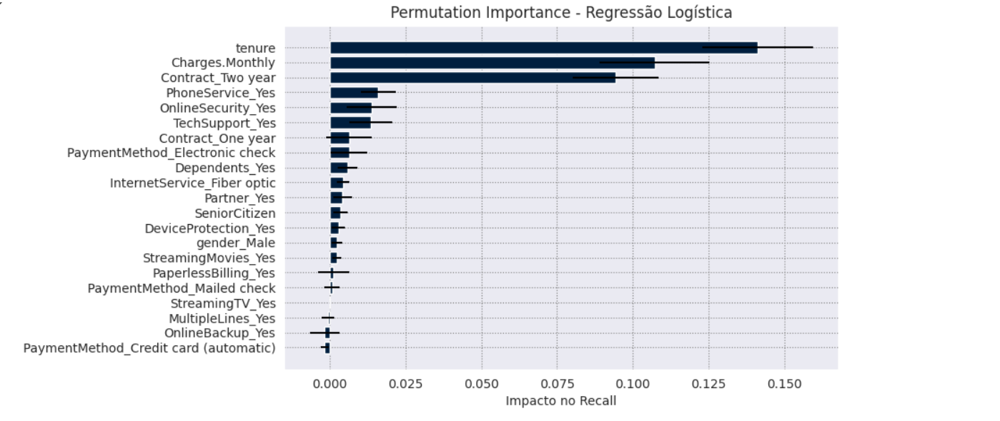
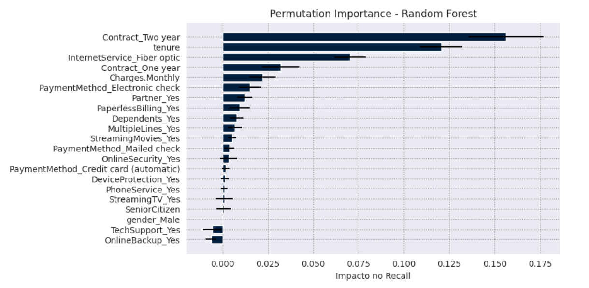

# 📊 Telecom X – Parte 2: Previsão de Evasão de Clientes (Churn) - Machine Learning
 
## 📌 Descrição do Projeto
 Este projeto é a parte 2 de uma análise exploratória dos dados onde nessa etapa construímos modelos de machine learning para previsão de evasão de clientes de uma empresa de telecomunicações. Utilizamos técnicas avançadas de análise de dados, machine learning e balanceamento de dados para identificar os principais fatores e padrões que contribuem para evasão de clientes.  

 📊 [Veja o projeto completo aqui](notebooks/Telecomx_projeto_churn_parte2_ml(1).ipynb)

 ## 🛠 Tecnologias Utilizadas
* Python 3.x
* Pandas, NumPy (manipulação e análise de dados)
* Matplotlib
* Scikit-learn

 ## 🤖 Modelos de Machine learning
  * **DummyRegressor (modelo baseline)**: Serve como referência, pois faz previsões simples sem realmente aprender com os dados. Ele mostra o desempenho mínimo esperado e ajuda a avaliar se outros modelos realmente agregam valor.
    
  * **Decision Tree**: Modelo fácil de interpretar, pois segue uma lógica de “se-então”(fluxograma). Pode capturar relações não lineares, mas tende a sofrer com overfitting se não houver regularização.
    
  * **Regressão Logística**: Um modelo estatístico clássico para classificação binária. É simples, interpretável e eficiente, mas pode ter limitações em capturar relações complexas entre variáveis.
    
  * **Random Forest**: Conjunto de várias árvores de decisão (Ensemble), reduzindo o risco de overfitting e melhorando a robustez. Costuma ter bom desempenho em problemas de classificação como churn, pois equilibra interpretabilidade e capacidade preditiva, capturando padrões mais complexos nos dados.

## 📊 Análise e Desempenho dos Modelos Treinados  

### Estratégia para lidar com o desbalanceamento entre as classes da variável alvo (Churn)

O dataset apresentava um desbalanceamento significativo entre clientes que deram churn e os que permaneceram. Para lidar com esse problema, foi utilizada a estratégia `class_weight="balanced"`, que ajusta automaticamente os pesos das classes de acordo com sua frequência.

Essa abordagem foi escolhida por alguns motivos:

**Preserva os dados originais**: diferentemente de técnicas como SMOTE, não há criação artificial de novas amostras, evitando risco de introduzir ruído.

**Integração direta ao modelo**: o ajuste é feito internamente no algoritmo de classificação, garantindo simplicidade e eficiência.

**Equilíbrio no aprendizado**: permite que o modelo atribua maior importância à classe minoritária, reduzindo a tendência de prever apenas a classe majoritária.

Em resumo, o uso de class_weight="balanced" proporcionou uma forma prática e confiável de lidar com o desbalanceamento, mantendo a integridade dos dados e evitando vieses no processo de modelagem.  

--- 

### Estratégia para lidar com a multicolinearidade 
O VIF (Variance Inflation Factor) foi utilizado no projeto para identificar e mitigar problemas de multicolinearidade entre as variáveis independentes. A multicolinearidade ocorre quando duas ou mais variáveis explicativas estão altamente correlacionadas entre si, o que pode distorcer os coeficientes do modelo, dificultando a interpretação dos resultados e reduzindo a robustez das estimativas. Dessa forma, foi possível avaliar quais variáveis apresentavam redundância de informação e tomar decisões mais conscientes sobre manter ou remover variáveis no modelo. 

Optei por utilizar essa técnica para não prejudicar o modelo de regressão logística visto que para os modelos de Árvore que também foram utilizados, a multicolinearidade tem um impacto menor mas ainda sim pode haver benefícios.   

| Faixa de VIF          | Interpretação                   |
|-----------------------|---------------------------------|
| VIF ≈ 1               | Sem multicolinearidade          |
| 1 < VIF < 5           | Baixa (aceitável)               |
| 5 ≤ VIF < 10          | Moderada (acompanhar)           |
| VIF ≥ 10              | Alta (atenção!)                 |
| VIF = ∞ (infinito)    | Multicolinearidade perfeita ⚠️ |

* Exemplo de VIF gerado:  

| Variável                           | VIF        |
|-----------------------------------|-----------|
| const                              | 31.308484 |
| Charges.Monthly                    | 22.356986 |
| InternetService_Fiber optic        | 7.554042  |
| tenure                             | 2.784158  |
| Contract_Two year                  | 2.610640  |
| StreamingMovies_Yes                | 2.417216  |
| StreamingTV_Yes                    | 2.400758  |
| PaymentMethod_Electronic check     | 1.973409  |
| TechSupport_Yes                    | 1.850009  |
| PaymentMethod_Mailed check         | 1.840793  |
| OnlineSecurity_Yes                 | 1.810495  |
| DeviceProtection_Yes               | 1.784591  |
| OnlineBackup_Yes                   | 1.708249  |
| MultipleLines_Yes                  | 1.630113  |
| Contract_One year                  | 1.620312  |
| PhoneService_Yes                   | 1.609719  |
| PaymentMethod_Credit card (automatic) | 1.560356 |
| Partner_Yes                        | 1.462143  |
| Dependents_Yes                     | 1.383601  |
| PaperlessBilling_Yes               | 1.208148  |
| SeniorCitizen                      | 1.153343  |
| gender_Male                        | 1.001830  |

--- 
### 📊 Matriz de confusão e métricas de avaliação 

A matriz de confusão é importante porque permite avaliar detalhadamente o desempenho de um modelo de classificação, mostrando quantos casos foram corretamente ou incorretamente classificados para cada classe. Ela fornece insights sobre acertos, erros e desequilíbrios entre classes, complementando métricas como acurácia, precisão, recall e F1-score. 

O foco principal no projeto são em clientes que abandonam o serviço (Churn = 1) porém como naturalmente são dados desbalanceados ou seja, a proporção de clientes que abandonam é menor do que a proporção de clientes ativos foquei em encontrar o equilibrio nas metricas de avaliação ao determinar os melhores modelos.  No contexto de previsão de churn, o **recall(sensibilidade) foi priorizado*** como métrica principal, pois representa a capacidade do modelo em identificar corretamente os clientes que realmente irão cancelar o serviço. Um recall elevado é essencial, já que perder clientes sem detectá-los gera impacto direto na receita e na retenção.

Entretanto, ao priorizar o recall, existe um **trade-off** com a precisão (precision): o modelo pode classificar alguns clientes como churn (falsos positivos) mesmo que não estejam em risco real. Apesar disso, esse custo tende a ser menos crítico para o negócio do que deixar de identificar clientes que efetivamente irão sair. Em resumo, o foco foi maximizar a detecção de clientes em risco, ainda que isso implique em abordagens de retenção para alguns clientes que não cancelariam(falsos positivos).

 
  

--- 
  

--- 
    

--- 
 

--- 
  

--- 
   

--- 

### Escolha do Melhor Modelo 

Após os testes comparativos, o Random Forest foi escolhido como melhor modelo para previsão de churn. Embora Logistic Regression e Decision Tree também tenham apresentado bom desempenho, o Random Forest conseguiu combinar:

* Maior recall para a classe "Yes" (clientes em risco), foco principal no problema de churn.

* Equilíbrio entre precisão e recall, evitando excesso de falsos positivos.

* Melhor f1-score geral para a classe "Yes", garantindo maior efetividade na detecção dos clientes que provavelmente irão cancelar.

O Dummy Classifier, usado como baseline, demonstrou que prever apenas a classe majoritária (clientes que não cancelam) não atende ao objetivo do projeto, já que não identificou nenhum churn real (recall = 0 para "Yes"). 

| Modelo              | Accuracy | Precision (Yes) | Recall (Yes) | F1-Score (Yes) | AUC  | AP   |
| ------------------- | -------- | --------------- | ------------ | -------------- | ---- | ---- |
| **Random Forest**   | **0.75** | **0.52**        | **0.81**     | **0.63**       | 0.84 | 0.66 |
| Logistic Regression | 0.74     | 0.51            | 0.79         | 0.62           | 0.84 | 0.66 |
| Decision Tree       | 0.73     | 0.49            | 0.81         | 0.61           | 0.83 | 0.61 |
| Dummy Classifier    | 0.73     | 0.00            | 0.00         | 0.00           | –    | –    |

➡️ Dessa forma, o **Random Forest** foi escolhido como o melhor modelo por apresentar melhor balanceamento entre as métricas e maior capacidade de identificar clientes com risco real de evasão. 

---

## 📊 Análise de Importância das Variáveis 

   

--- 

    

## 📈 Principais efeitos esperados na empresa de telecom

Com base nos resultados que você obteve (onde o modelo especialmente Random Forest conseguiu bom recall para churn “Yes”), os efeitos esperados seriam:

* Identificação antecipada de clientes em risco, como um radar: O modelo consegue detectar com razoável precisão quais clientes têm alta chance de cancelar. Isso permite ações preventivas.

* Ações de retenção direcionadas: A empresa pode focar em clientes com maior probabilidade de churn, reduzindo custos em campanhas genéricas.

* Otimização de recursos: Em vez de oferecer descontos ou benefícios a todos, o time de retenção foca nos clientes críticos, aumentando ROI.

* Aprimoramento de ofertas e serviços: Variáveis importantes como tenure, contract type e monthly charges indicam perfis de maior risco. Esses insights ajudam a revisar políticas de contratos, preços ou planos.

Em um contexto real, isso se traduz na capacidade de a empresa de telecom implementar ações proativas e personalizadas de retenção, aumentando a probabilidade de manter clientes de alto valor. Se a empresa conseguir reter apenas uma fração dos clientes em risco, o impacto financeiro já é significativo: maior receita preservada, menor taxa de evasão e aumento no valor de vida do cliente (LTV). Isso coloca a área de negócios em uma posição mais competitiva e orientada a dados para tomadas de decisão.

## 🚀 Próximos passos e melhorias
* Otimizar hiperparâmetros
* Treinar outros modelos de machine learning possíveis como XGBoost com foco na melhora de performance preditiva.
* Feature engineering
